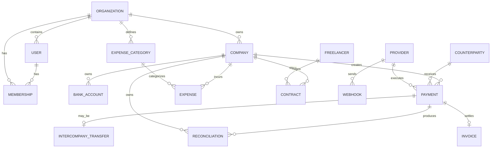

# 01 — PostgreSQL Database Specification

## Principles

- UUID primary keys
- UTC timestamps (`timestamptz`)
- database foreign keys
- explicit status enums
- NUMERIC/decimal for monetary values
- no floating point money
- soft delete only where business history permits
- immutable financial history where required

## Entity hierarchy

## Tables

### organizations

- id UUID PK
- name VARCHAR(200)
- base_currency CHAR(3)
- status
- created_at
- updated_at

### companies

- id UUID PK
- organization_id FK
- legal_name
- country_code CHAR(2)
- registration_number
- tax_identifier
- base_currency CHAR(3)
- status
- created_at
- updated_at

Unique:
`(organization_id, legal_name)`

### users / auth tables

Authentication tables are owned by Better Auth and generated according to its current PostgreSQL adapter/schema.

Application-specific authorization is separate:
- memberships
- company_memberships
- roles
- permissions

Do not manually fork Better Auth's core schema without a documented reason.

### memberships

- id UUID PK
- organization_id FK
- user_id FK
- role
- created_at

Unique:
`(organization_id, user_id)`

### company_memberships

- id UUID PK
- company_id FK
- user_id FK
- role

Unique:
`(company_id, user_id)`

### bank_accounts

- id UUID PK
- company_id FK
- provider_id nullable
- name
- bank_name
- iban nullable
- account_number_last4 nullable
- currency CHAR(3)
- status
- ledger_account_address
- created_at
- updated_at

Do not store full credentials here.

### counterparties

- id UUID PK
- organization_id FK
- legal_name
- type
- country_code
- registration_number nullable
- tax_identifier nullable
- external_reference nullable
- status
- created_at
- updated_at

### beneficiaries

- id UUID PK
- counterparty_id FK
- payment_method
- payout_details_encrypted
- status
- created_at
- updated_at

### providers

- id UUID PK
- organization_id FK
- type
- name
- status
- configuration_reference
- created_at
- updated_at

Provider secrets must be stored in a secret manager or encrypted secret store, not plain database columns.

### payments

- id UUID PK
- organization_id FK
- company_id FK
- beneficiary_id FK
- provider_id nullable
- contract_id nullable
- amount NUMERIC(20,8)
- currency VARCHAR(20)
- payment_type
- payment_method
- status
- idempotency_key
- provider_payment_id nullable
- ledger_transaction_id nullable
- requested_by FK
- approved_by FK nullable
- requested_at
- approved_at nullable
- executed_at nullable
- settled_at nullable
- failure_code nullable
- failure_reason nullable
- created_at
- updated_at

Unique:
`(company_id, idempotency_key)`

### intercompany_transfers

- id UUID PK
- organization_id FK
- from_company_id FK
- to_company_id FK
- payment_id FK
- amount
- currency
- purpose
- status
- due_at nullable
- sent_at nullable
- received_at nullable
- reconciled_at nullable

### expense_categories

- id UUID PK
- organization_id FK
- code
- name
- parent_id nullable

### expenses

- id UUID PK
- organization_id FK
- company_id FK
- category_id FK
- counterparty_id nullable
- contract_id nullable
- amount
- currency
- recurrence
- due_date
- status
- budget_amount nullable
- payment_id nullable
- created_at
- updated_at

### freelancers

- id UUID PK
- organization_id FK
- legal_name
- country_code
- email
- payout_method
- status
- created_at
- updated_at

### contracts

- id UUID PK
- organization_id FK
- company_id FK
- freelancer_id nullable
- counterparty_id nullable
- contract_number
- start_date
- end_date nullable
- scope
- rate
- currency
- payment_terms
- status
- signature_status
- current_document_id nullable
- created_at
- updated_at

### invoices

- id UUID PK
- organization_id FK
- company_id FK
- counterparty_id FK
- contract_id nullable
- invoice_number
- amount
- currency
- issue_date
- due_date
- status
- payment_id nullable

### documents

- id UUID PK
- organization_id FK
- object_type
- object_id
- storage_key
- sha256
- mime_type
- size_bytes
- version
- created_at

### webhooks

- id UUID PK
- provider_id FK
- external_event_id
- event_type
- signature_valid
- payload_hash
- received_at
- processed_at nullable
- status
- error_message nullable

Unique:
`(provider_id, external_event_id)`

### reconciliations

- id UUID PK
- organization_id FK
- company_id FK
- provider_id nullable
- payment_id nullable
- internal_reference
- external_reference
- amount
- currency
- status
- matched_at nullable
- exception_reason nullable
- resolved_by nullable
- resolved_at nullable

### audit_events

- id UUID PK
- organization_id FK
- actor_user_id nullable
- action
- object_type
- object_id
- correlation_id
- metadata_json JSONB
- created_at

Audit rows are append-only.

## Database rules

1. Foreign keys must be enforced.
2. Monetary amounts must be NUMERIC.
3. Status transitions belong in domain services, not UI.
4. Payment idempotency is mandatory.
5. Webhook event uniqueness is mandatory.
6. Ledger transaction IDs are references, not substitutes for business records.
