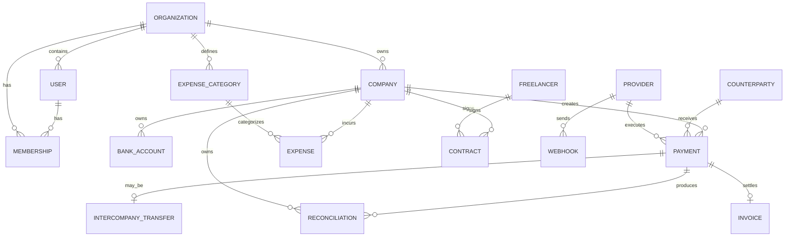

# 01 — PostgreSQL Database Specification

## Principles

- UUID primary keys
- UTC timestamps (`timestamptz`)
- database foreign keys
- explicit status enums
- NUMERIC/decimal for monetary values
- no floating point money
- soft delete only where business history permits
- immutable financial history where required

## Entity hierarchy

## Tables

### organizations

- id UUID PK
- name VARCHAR(200)
- base_currency CHAR(3)
- status
- created_at
- updated_at

### companies

- id UUID PK
- organization_id FK
- legal_name
- country_code CHAR(2)
- registration_number
- tax_identifier
- base_currency CHAR(3)
- status
- created_at
- updated_at

Unique:
`(organization_id, legal_name)`

### users / auth tables

Authentication tables are owned by Better Auth and generated according to its current PostgreSQL adapter/schema.

Application-specific authorization is separate:
- memberships
- company_memberships
- roles
- permissions

Do not manually fork Better Auth's core schema without a documented reason.

### memberships

- id UUID PK
- organization_id FK
- user_id FK
- role
- created_at

Unique:
`(organization_id, user_id)`

### company_memberships

- id UUID PK
- company_id FK
- user_id FK
- role

Unique:
`(company_id, user_id)`

### bank_accounts

- id UUID PK
- company_id FK
- provider_id nullable
- name
- bank_name
- iban nullable
- account_number_last4 nullable
- currency CHAR(3)
- status
- ledger_account_address
- created_at
- updated_at

Do not store full credentials here.

### bank_reservations (Phase 3 — not in the original spec)

- id UUID PK
- organization_id FK
- company_id FK
- bank_account_id FK
- amount NUMERIC(20,8)
- currency CHAR(3)
- status (ACTIVE, RELEASED)
- ledger_transaction_id — Formance transaction id for the reserve posting
- release_ledger_transaction_id nullable — set once released
- idempotency_key
- correlation_id
- requested_by
- requested_at
- released_at nullable

Unique: `(bank_account_id, idempotency_key)`

Not a balance — `docs/00-ARCHITECTURE-FREEZE.md` rule 4/5. A pointer
into Formance Ledger, same role `payments.ledger_transaction_id` plays.

### bank_transfers (Phase 3 — not in the original spec)

- id UUID PK
- organization_id FK
- company_id FK
- bank_account_id FK (source)
- destination_account_id FK (another bank_accounts row, same company — Phase 3 does not model intercompany/counterparty destinations, that is Phase 4)
- amount NUMERIC(20,8)
- currency CHAR(3)
- status (IN_TRANSIT, SETTLED)
- start_ledger_transaction_id
- settle_ledger_transaction_id nullable
- idempotency_key
- correlation_id
- requested_by
- requested_at
- settled_at nullable

Unique: `(bank_account_id, idempotency_key)`

### counterparties

- id UUID PK
- organization_id FK
- legal_name
- type — Phase 6 enum: COMPANY, INDIVIDUAL
- country_code
- registration_number nullable
- tax_identifier nullable
- external_reference nullable
- status — Phase 6 enum: ACTIVE, INACTIVE
- created_at
- updated_at

### beneficiaries

- id UUID PK
- counterparty_id FK
- payment_method — Phase 6 enum: BANK_TRANSFER, CRYPTO_EXCHANGE, CARD_PAYOUT, MANUAL (shared with payments.payment_method)
- payout_details_encrypted — Phase 6: AES-256-GCM at the application layer (lib/crypto/encryption.ts, key from `PAYOUT_ENCRYPTION_KEY`), never returned in plaintext by any read path
- status — Phase 6 enum: ACTIVE, INACTIVE
- created_at
- updated_at

### providers

- id UUID PK
- organization_id FK — NOT NULL: every org gets its own row per provider type, auto-provisioned on first use (lib/providers/registry.ts getOrCreateProvider) rather than a manual "configure a provider" flow — there's nothing to configure for a mock provider
- type — Phase 6: MOCK_BANK, MOCK_CRYPTO, MOCK_PAYOUT (docs/06-PROVIDER-INTERFACES.md); a real value needs its own provider-specific task per CLAUDE.md rule 13
- name
- status — Phase 6 enum: ACTIVE, INACTIVE
- configuration_reference
- created_at
- updated_at

Unique: `(organization_id, type)`

Provider secrets must be stored in a secret manager or encrypted secret store, not plain database columns.

### payments (Phase 6)

- id UUID PK
- organization_id FK
- company_id FK
- beneficiary_id FK
- counterparty_id nullable — Phase 6, not in the original spec; denormalized from beneficiary_id at creation so a payment doesn't need a beneficiary join to know its counterparty (also the FK lib/ledger/accounts.ts counterpartyAddress() needs at execute time)
- bank_account_id FK — Phase 6, not in the original spec; the original payments table has no funding-source column, but executePayment must know which BankAccount to debit for the ledger BANK -> IN_TRANSIT posting (docs/02-LEDGER-SPEC.md pattern C). Mirrors intercompany_transfers.bank_account_id
- provider_id nullable
- contract_id nullable
- amount NUMERIC(20,8)
- currency VARCHAR(20)
- payment_type
- payment_method
- status (PENDING_APPROVAL, APPROVED, PROCESSING, SETTLED, FAILED, REJECTED, CANCELLED) — trimmed from `prisma/schema.prisma.example`'s 10-state sketch to the 7 states this phase's endpoints actually drive; no DRAFT (POST /payments creates directly at PENDING_APPROVAL, same as intercompany_transfers/expenses), no SENT/REVERSED (not reachable by any endpoint yet)
- idempotency_key
- provider_payment_id nullable
- ledger_transaction_id nullable — startTransfer() result, set on execute
- settle_ledger_transaction_id nullable — Phase 6, not in the original spec; settleTransfer()/reverseTransfer() result depending on outcome, same pointer-field precedent as bank_transfers.settle_ledger_transaction_id
- retry_count — Phase 6, not in the original spec; backs the "failure/retry model" roadmap item, capped at 3 in lib/payments/payments.ts
- requested_by FK
- approved_by FK nullable
- requested_at
- approved_at nullable
- executed_at nullable
- settled_at nullable
- failure_code nullable
- failure_reason nullable
- created_at
- updated_at

Unique:
`(company_id, idempotency_key)`

### intercompany_transfers

- id UUID PK
- organization_id FK
- from_company_id FK
- to_company_id FK
- bank_account_id FK — source, must belong to from_company_id
- destination_account_id FK — must belong to to_company_id, same currency as source (no FX support)
- payment_id FK, deferred — no `payments` table exists yet (Phase 6); do not add this FK until it does
- amount NUMERIC(20,8)
- currency CHAR(3)
- purpose nullable
- status (PENDING_APPROVAL, APPROVED, REJECTED) — this row's PENDING_APPROVAL state is the "obligation"; there is no separate obligations table
- due_at nullable
- start_ledger_transaction_id nullable — set on approve
- settle_ledger_transaction_id nullable — set on approve
- idempotency_key
- correlation_id
- requested_by
- requested_at
- approved_by nullable
- sent_at nullable
- received_at nullable
- reconciled_at nullable
- rejected_by nullable
- rejected_at nullable
- rejection_reason nullable

Unique: `(bank_account_id, idempotency_key)`

### expense_categories

- id UUID PK
- organization_id FK
- code
- name
- parent_id nullable

### expenses

- id UUID PK
- organization_id FK
- company_id FK
- category_id FK
- counterparty_id nullable
- contract_id nullable
- amount
- currency
- recurrence
- due_date
- status
- budget_amount nullable
- payment_id nullable
- approved_by nullable — Phase 5, not in the original spec; mirrors
  `payments.approved_by` for the same approval-workflow display need
  Phase 4 already solved for `intercompany_transfers.approvedBy`
- approved_at nullable — Phase 5, pairs with approved_by
- created_at
- updated_at

`counterparty_id`/`contract_id`/`payment_id` reference tables that
don't exist yet (Phase 6/7) — plain columns, no FK, same pattern as
`bank_accounts.provider_id`. `recurrence` is a label only as of Phase 5:
nothing generates future `expenses` rows from it — that's Phase 8
Forecast's job.

### budgets (Phase 5 — not in the original spec)

- id UUID PK
- organization_id FK
- company_id FK
- category_id FK
- period_year
- period_month (1-12)
- amount NUMERIC(20,8)
- currency CHAR(3)
- created_at
- updated_at

Unique: `(company_id, category_id, period_year, period_month)`

One monthly budget line per company/category. Not a balance and not a
ledger pointer — a plan number the application compares against the
sum of that period's `APPROVED` expenses (same category, matching
currency) to produce "actual vs budget". Same "documented
extension" precedent as `bank_reservations`/`bank_transfers`/
`intercompany_transfers` in Phase 3/4.

### freelancers

- id UUID PK
- organization_id FK
- legal_name
- country_code
- email
- payout_method
- status
- created_at
- updated_at

### contracts

- id UUID PK
- organization_id FK
- company_id FK
- freelancer_id nullable
- counterparty_id nullable
- contract_number
- start_date
- end_date nullable
- scope
- rate
- currency
- payment_terms
- status
- signature_status
- current_document_id nullable
- created_at
- updated_at

### invoices

- id UUID PK
- organization_id FK
- company_id FK
- counterparty_id FK
- contract_id nullable
- invoice_number
- amount
- currency
- issue_date
- due_date
- status
- payment_id nullable

### documents

- id UUID PK
- organization_id FK
- object_type
- object_id
- storage_key
- sha256
- mime_type
- size_bytes
- version
- created_at

### webhooks

- id UUID PK
- provider_id FK
- external_event_id
- event_type
- signature_valid
- payload_hash
- received_at
- processed_at nullable
- status — Phase 6 enum: RECEIVED, PROCESSED, IGNORED, ERROR
- error_message nullable

Unique:
`(provider_id, external_event_id)` — Phase 6: the dedup key for CLAUDE.md rule 8. A row already PROCESSED short-circuits as a duplicate; a row stuck at RECEIVED/ERROR is retried in place (lib/providers/webhook.ts).

### oauth_states (Phase 9A — not in the original spec)

- id UUID PK (the state token itself)
- organization_id FK
- user_id
- provider_type
- company_id nullable
- created_at
- expires_at
- consumed_at nullable

Server-side OAuth authorization-code state — crypto-random, bound at
issuance, single-use (`consumed_at` set atomically on first valid
callback; see docs/13-PIRAEUS-PROVIDER.md). Short TTL, not a long-lived
table — no index beyond `expires_at` for cleanup.

### provider_connections (Phase 9A — not in the original spec)

- id UUID PK
- organization_id FK
- provider_id FK
- status (PENDING, CONNECTED, FAILED, REVOKED)
- encrypted_access_token nullable
- encrypted_refresh_token nullable
- token_expires_at nullable
- granted_scope nullable
- version — optimistic-concurrency guard against corrupting stored tokens on a concurrent refresh (docs/13-PIRAEUS-PROVIDER.md)
- last_error nullable
- connected_by nullable
- connected_at nullable
- revoked_at nullable
- created_at
- updated_at

Unique: `(organization_id, provider_id)` — one OAuth session per org
per provider, mirrors `providers`' own `(organization_id, type)`
uniqueness. Tokens are opaque ciphertext (AES-256-GCM,
`PIRAEUS_TOKEN_ENCRYPTION_KEY`), never plaintext.

### provider_account_links (Phase 9A — not in the original spec)

- id UUID PK
- bank_account_id FK
- provider_connection_id FK
- external_account_id — the provider's own opaque identifier
- external_account_fingerprint — keyed HMAC (`PIRAEUS_FINGERPRINT_KEY`), never a plain hash
- status (ACTIVE, UNLINKED)
- linked_by
- linked_at
- unlinked_at nullable

Binds one existing `bank_accounts` row to one external provider
account. Explicit, one-at-a-time (never auto-linked). Only one `ACTIVE`
link per `bank_account_id`, enforced by a partial unique index
(hand-written SQL in the migration — no native Prisma syntax for it).

### balance_observations (Phase 9A — not in the original spec)

- id UUID PK
- organization_id FK
- company_id FK
- bank_account_id FK
- provider_account_link_id FK
- balance_type — free text, not an enum (the exact vocabulary PB API Accounts v1.2 returns is unconfirmed, docs/13-PIRAEUS-PROVIDER.md)
- amount NUMERIC(20,8)
- currency CHAR(3)
- observed_at
- created_at

A point-in-time external balance reading. Purely observational — see
docs/02-LEDGER-SPEC.md-style invariant in docs/13-PIRAEUS-PROVIDER.md
"Balance invariant": never written back into Formance.

### external_transactions (Phase 9A — not in the original spec)

- id UUID PK
- organization_id FK
- company_id FK
- bank_account_id FK
- provider_account_link_id FK
- external_transaction_id nullable — the provider's own stable id, preserved verbatim when supplied
- fingerprint — the actual dedup key: external_transaction_id when present, else a keyed HMAC fallback over (bank_account_id, booking_date, amount, currency, remittance_info)
- booking_date
- value_date nullable
- amount NUMERIC(20,8)
- currency CHAR(3)
- credit_debit_indicator (CREDIT, DEBIT)
- remittance_info nullable
- counterparty_name nullable
- counterparty_iban nullable — DB-only, same precedent as bank_accounts.iban; never logged
- provider_reference_code nullable
- synced_at
- created_at

Unique: `(bank_account_id, fingerprint)` — a repeated sync of the same
date range always reports 0 new rows on the second run. An external
observation, modeled separately from `payments`/Formance postings —
never auto-posted.

### sync_states (Phase 9A — not in the original spec)

- id UUID PK
- provider_account_link_id FK, unique
- status (IDLE, SYNCING, ERROR)
- last_synced_at nullable
- last_synced_booking_date nullable
- consecutive_failures
- last_error nullable
- next_allowed_sync_at nullable — cooldown/rate guard for manual sync
- updated_at

One cursor per linked account, read/written only by
`scripts/piraeus-sync-worker.ts` and the manual-sync API route.

### reconciliations

Not implemented as of Phase 6/9A — docs/05-MVP-ROADMAP.md's Phase 6 bullets (approval workflow, provider interface, mock provider, webhook framework, failure/retry model) don't call for it, and Phase 9A is deliberately read-only/non-reconciling; reconciliation exceptions arrive with Phase 9B's real provider payment execution.

- id UUID PK
- organization_id FK
- company_id FK
- provider_id nullable
- payment_id nullable
- internal_reference
- external_reference
- amount
- currency
- status
- matched_at nullable
- exception_reason nullable
- resolved_by nullable
- resolved_at nullable

### audit_events

- id UUID PK
- organization_id FK
- actor_user_id nullable
- action
- object_type
- object_id
- correlation_id
- metadata_json JSONB
- created_at

Audit rows are append-only.

## Database rules

1. Foreign keys must be enforced.
2. Monetary amounts must be NUMERIC.
3. Status transitions belong in domain services, not UI.
4. Payment idempotency is mandatory.
5. Webhook event uniqueness is mandatory.
6. Ledger transaction IDs are references, not substitutes for business records.
